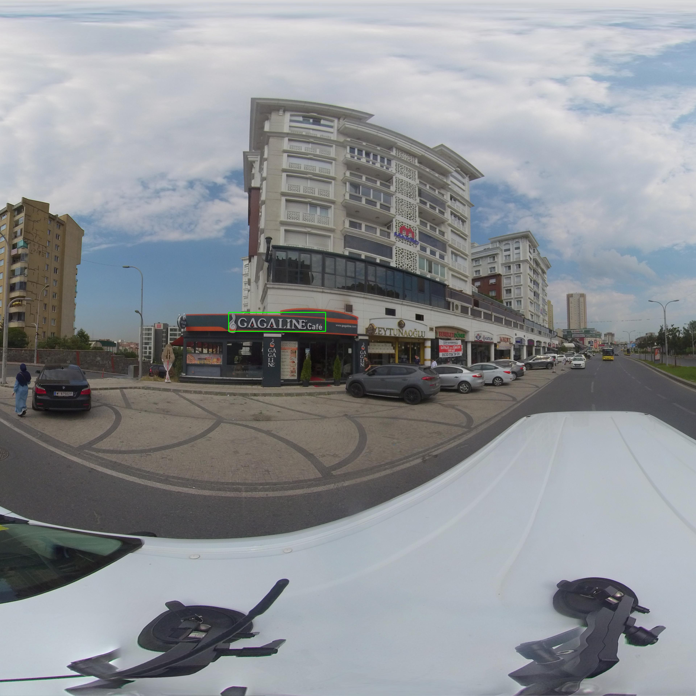
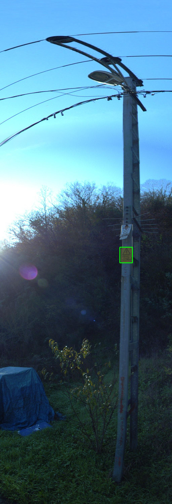

# **YOLOV4 İLE TABELA TESPİT**

###  Yolo algoritmasi kullanılarak geliştirilmiştirdiğim Utility Pole Information Plate (elektrik direği bilgi tabelası ) ve SignStore (dükkan tabelası) objelerini tanıyan algoritmayı tanıtacağım


 </img>
 </img>


<br><br>
## **Data Set Düzenlenmesi**

#### [visiosoft](http://www.visiosoft.com.tr) tarafından toplam 482 tane data hazırlandı.Bu data Utility Pole Information Plate (elektrik direği bilgi tabelası ) ve SignStore (dükkan tabelası) adlı iki obje içeriyor .datadaki verilerden bazılırı  geniş açılı ve yüksek çözünürlükteki verilerdi.
#### Bu veriler <font  color="aqua "> x1 y1 w h </font> formatı ile etiketlenmişti . Verileri eyitmek için gereken yolo modeli forma olarak  <font  color="aqua "> x y  w h </font>  sıralaması ile ilerliyordu verilerin uygun formatlanması için python dilinden  yararlandım .
<br/>

```PowerShell
import json
import os
import numpy as np
import matplotlib.pyplot as plt
import cv2
from tqdm import tqdm as tqdm

data = json.load(open('annotations/annotation.json')) # load jeson data into code
```

#### Veriler <font  color="pink "> json</font> formatı ile verilmişti verileri buzeltmek için  <font  color="pink "> json</font> kütüphanesinden yararlandım. Verileri okumak için  <font  color="pink "> data = json.load(open('annotations/annotation.json'))</font> kodundan yararlandım
<br/>

```PowerShell
def format_label(data,image_about,image_path):
    #   format=[file_name,w,h,category,boxs]

    filname=[]
    for i in data:
        for k in image_about:
            if i["id"] == k["image_id"]:
                formatla=[os.path.join(image_path,i["file_name"]),
                          i["width"],
                          i["height"],
                          k["category_id"],
                          k["bbox"]
                ]
                filname.append(formatla)
                break

    return np.array(filname)

images=format_label(x,segment,"images")
```

#### Verileri yolo formatına çevirmeden önce etiket içerisini inceleme ve gerekli etiketleri almak için <font  color="pink ">format=[file_name,w,h,category,boxs] </font> olarak  yeniden formatladım.


<br/>

```PowerShell
def x1_y1_convert(boxx):

        x,y,w,h=boxx # orginal format x1,y1,w,h

        x1=int(x)
        x2=int(x+(w))
        y1=int(y)
        y2=int(y+(h))

        return [(x1,y1),(x2,y2)]

images[:,4]=[x1_y1_convert(i) for i in images[:,4]]

```

#### Veriler yetersiz kalabileceğinden verileri çoğaltmak için her bir resime kırpma uyguladım . Veri seti  üzerinden kırpma  işlemini kulanmak için obje konumunu belirleyen etiketleri  <font  color="pink "> boxx = x1 y1 x2 y2 </font>  olarak tekrar formatladım

<br/>

```PowerShell
def resim_kırpma(img,img_box=("x1","x2")):
    img_shape=img.shape

    image_center_point=(img_shape[0]/2,img_shape[1]/2)

    image_center_x=image_center_point[1]

    if image_center_x<img_box[0] :
        img=img[:,int(image_center_x):]
        nex_points_x=(img_box[0]-image_center_x,img_box[1]-image_center_x)

    elif image_center_x>img_box[1]:
        img=img[:,:int(image_center_x)]
        nex_points_x=img_box
    else:
        img=img[:,:int(image_center_x)+(img_box[1]-img_box[0])]
        nex_points_x=img_box
    return img,nex_points_x

```

#### Resim dosyalarını  <font  color="pink "> resim_kırpma() </font> fonksiyonu ile resimleri ortadan ikiye ayırdım. Bu sayede verileri bozmadan ,ayrıntıları fazla kaçırmadan objenin bulunduğu bölgeyi aldım.


<br/>

```PowerShell
def save_image(img_label,s,test=False):
    img=plt.imread(img_label[0])
    if test:
        img_label[0]=f"hazir_veri\\test_veri\\{s}.jpg"
    else:
        img_label[0]=f"hazir_veri\\{s}.jpg"

    img_label[-1]=yolov_format(img_label[1:3],img_label[-1])
    plt.imsave(img_label[0],img)


    save_for_txt(img_label)

```
#### Son olarak kırpılmış verileri kaydetmek için <font  color="pink "> save_image() </font> fonksiyonundan yararlanıldım.


<br/>

```PowerShell

def yolov_format(image_size=("H","W"),boxxes=[("x1","y1"),("x2","y2")]):

    IW,IH=image_size[0],image_size[1]

    try:
        (x1,y1),(x2,y2)=boxxes
    except:
        x1,y1,x2,y2=boxxes


    w,h=abs(x2-x1),abs(y2-y1)
    x,y=x1+(w/2),y1+(h/2)

    #   yolo format x/IW  y/IH w/IW h/IH
    return [x/IW,y/IH,w/IW,h/IH]

```

#### Etiketleri kaydetme den önce boxx değerlerini <font  color="pink "> x y w h </font> formatına dönuştürmek için <font  color="pink "> yolov_format() </font> fonksiyonundan  yararlandım.Veriler yolo modeline  aktarılmaya hazır hale getirdim.

<br/>

```PowerShell
def shuffle(array_num,shufle_num):
    array=list(range(array_num))
    for i in range(shufle_num):
        np.random.shuffle(array)

    return array

```
#### Modelin verimliliğini artırmak için veri setini karıştırmak için etiketleri  <font  color="pink "> shuffle() </font> foksiyonundan geçirdim.

<br/>

```PowerShell
def save_for_txt(img_label):
     with open(img_label[0].split(".")[0]+".txt","w") as file:
        # yolov format pc x,y,w,h
        pc=img_label[-2]

        x,y,w,h=img_label[-1]
        yolo=str(pc-1)+" "+str(x)+" "+str(y)+" "+str(w)+" "+str(h)
        file.write(yolo)


```

####  Son olarak etiketleri kaydetme işlemi ile veri düzenleme kısmını bitirmiş oldum.

<br/><br/><br/>


# **YOLOV4 NESNE TANIMA (OBJECT DETECTİON)**

### Veri setimi  <font  color="pink "> yolov4 </font> modeli kulanarak eğittim. Yolov4'ü seçmemin asıl nedeni stabilite açısından yolov3 ten daha iyi olması. Model eğitimimi altaki sırayla eğittim.
<br/><br/>

- ## **ADIM 1: DARKNET KLONLAMA VE KURULUMU**

```PowerShell
# clone darknet repo
!git clone https://github.com/AlexeyAB/darknet

# change makefile to have GPU and OPENCV enabled

%cd darknet
!sed -i 's/OPENCV=0/OPENCV=1/' Makefile
!sed -i 's/GPU=0/GPU=1/' Makefile
!sed -i 's/CUDNN=0/CUDNN=1/' Makefile
!sed -i 's/CUDNN_HALF=0/CUDNN_HALF=1/' Makefile

# Cihazdaki GPU bilgisi
!nvidia-smi

;# make darknet (builds darknet so that you can then use the darknet executable file to run or train object detectors)
!make

```

#### yukardaki adımlarla sırasıyla <font  color="pink "> darknet </font> kıtaplağını kodun içerisine dahil ediyoruz. Modelimizin GPU ve Opencv kütüphanelerini kulanacağını söylüyoruz ve make ile modelimizi derliyoruz.

<br/><br/>

## **ADIM 2: YARDIMCI FONKSİYONLARIN TANIMLANMASI**


```PowerShell
# define helper functions
def imShow(path):
  import cv2
  import matplotlib.pyplot as plt
  %matplotlib inline

  image = cv2.imread(path)
  height, width = image.shape[:2]
  resized_image = cv2.resize(image,(3*width, 3*height), interpolation = cv2.INTER_CUBIC)

  fig = plt.gcf()
  fig.set_size_inches(18, 10)
  plt.axis("off")
  plt.imshow(cv2.cvtColor(resized_image, cv2.COLOR_BGR2RGB))
  plt.show()

# use this to upload files
def upload():
  from google.colab import files
  uploaded = files.upload()
  for name, data in uploaded.items():
    with open(name, 'wb') as f:
      f.write(data)
      print ('saved file', name)

# use this to download a file
def download(path):
  from google.colab import files
  files.download(path)
```

#### Yukarıdaki kodlar sayesinde model eğitildikten sonra istediğimiz veri üzerinden tahmin işlevimizi yapmak için verilerimizi okuma ve bastırma işlevlerini yerine getiren kodlar vardır.

<br><br>

##  **ADIM 3: HAZIRLAMIŞ OLDUĞUMUZ VERİ SETİNİ YÜKLEME**

```PowerShell
%cd ..
from google.colab import drive
drive.mount('/content/gdrive')
```
#### Google driver dosyalarımıza erişim için bağlantı sağlayan kodları içeri aktarıyoruz.
<br>

```PowerShell
#  verilerimizin bulunduğu klasörü  kısaltma olarak mydrive olarak ayarlıyoruz
!ln -s /content/gdrive/My\ Drive/ /mydrive
!ls /mydrive


#  konumumuzu darknet olarak değiştiriyoruz
%cd /content/darknet
# verilerin bulunduğu kalasör içindeki dosyaları lısteliyoruz
!ls /mydrive/yolov4


# verilerimizi darknet kütüphanesine aktarıyoruz
!cp /mydrive/yolov4/hazir_veri.rar ../
!cp /mydrive/yolov4/test_veri.rar ../


# rar çimdeki verilerimizi unrar aracı ile rar  dan çıkarıyoruz
!unrar x ../hazir_veri.rar -d data/
!unrar x ../test_veri.rar -d data/

```
#### Veri dosyalarımızı darknet ağının içerisine aktarmak için gereken koları çalıştırıyoruz.

<br><br>

### **ADIM 5: EĞİTİM İÇİN GEREKLİ DOSYALARI HAZIRLAYALIM**


```PowerShell
# yolov konfigrasyon dosyasını drayvırımıza kopyalıyoruz
!cp cfg/yolov4-custom.cfg /mydrive/yolov4/yolov4-obj.cfg


# yolov konfigrasyon dosyamızı tekrar darknete atrarıyoruz
!cp /mydrive/yolov4/yolov4-obj.cfg ./cfg

```
#### yolov konfigrasyon dosyası olan <font  color="pink "> yolov4-obj.cfg </font> dosyasını düzenlemek için driver'i mize yükleyyip sırası ile şu değişiklikleri yapıyoruz;


- (Burada verilen değerler bu değişkenlerin önerilen değerleridir.)
- learning rate değerini 0.00321 olarak değiştiriyoruz

- batch = 64 ve subdivision 16.

- max_batches değerini (2000 * eğitilen sınıf sayısı) değerine eşitliyoruz.

- steps değerlerini (%80 of max_batches) , (%90 of max_batches) yapıyoruz.

- [yolo] başlığı altındaki classes değerlerini eğitim yaptığımız sınıf sayısı ile değiştiriyoruz.

- filters değişkenlerini de (eğitim yapacağımız sınıf sayısı + 5 )*3 değerine eşitliyoruz

<br>

```PowerShell
# obj.name ve obj.data dosyalarını içeri aktar
!cp /mydrive/yolov4/obj.names ./data
!cp /mydrive/yolov4/obj.data  ./data

```
#### <font  color="pink "> obj.data </font> ve <font  color="pink "> obj.name </font> dosyalarımızı driver'ımızda oluşturup bunları darknete aktarıyoruz.
<br>
- *obj.data dosyamızın içeriği*;


```PowerShell
classes = 2
train = data/train.txt
valid = data/test.txt
names = data/obj.names
backup = /mydrive
```

#### şeklinde ve;
<br>

- *obj.name dosyamızın içeriği;*


```PowerShell
elektrik_tabelasi
is_yeri_tabelasi
```
#### şeklinde düzenlenecek
<br><br>


```PowerShell

# verileri modele sırayla göndermek ve belek yönetimi için generatör dosyalarımızı oluşturuyotuz
!cp /mydrive/yolov4/generate_train.py ./
!cp /mydrive/yolov4/generate_test.py ./


!python generate_train.py
!python generate_test.py

# darknet/data klasörüne bakıp dosyaların yüklendiğinden emin oluyoruz
!ls data/

```

#### <font  color="pink "> generate_train.py </font> ve <font  color="pink "> generate_test.py </font> dosyalarımızı driver'ımızda oluşturup bunları darknete aktarıyoruz. Bunlar bize bellek yönetiminde avantaj sağlayacak dosyalardır. Verilerimizi belirli bir sıra içerisinde modelimize verecek olan dosyalarımızdır.
#### Bunları içeri aktardıktan sonra çalıştıracağız ve bize <font  color="pink "> train.txt </font> ve <font  color="pink "> test.txt</font> adlı iki dosya oluşturacaklardır.
<br>

- *generate_train.py dosyamızın içeriği*;


```PowerShell
import os
image_files = []
os.chdir(os.path.join("data", "hazir_veri"))
for filename in os.listdir(os.getcwd()):
    if filename.endswith(".jpg"):
        image_files.append("data/hazir_veri/" + filename)
os.chdir("..")
with open("train.txt", "w") as outfile:
    for image in image_files:
        outfile.write(image)
        outfile.write("\n")
    outfile.close()
os.chdir("..")
```

#### şeklinde ve;
<br>

- *generate_test.py  dosyamızın içeriği;*


```PowerShell
import os

image_files = []
os.chdir(os.path.join("data", "test_veri"))
for filename in os.listdir(os.getcwd()):
    if filename.endswith(".jpg"):
        image_files.append("data/test_veri/" + filename)
os.chdir("..")
with open("test.txt", "w") as outfile:
    for image in image_files:
        outfile.write(image)
        outfile.write("\n")
    outfile.close()
os.chdir("..")
```
#### şeklinde düzenlenecek
<br><br>


### **ADIM 6: ÖNCEDEN EĞİTİLMİŞ CONVOLUTİONAL KATMANLARIN AĞIRLIKLARINI İNDİRME**


```PowerShell
!wget https://github.com/AlexeyAB/darknet/releases/download/darknet_yolo_v3_optimal/yolov4.conv.137
```
#### Bu adımda önceden eğitilmiş <font  color="pink "> yolov4 </font> için kullanılmış deeplearning katmanları ağırlıklarını indiriyoruz. Bu adımı uygulamak zorunda değiliz ama eğitime bu ağırlıklarla başlamak eğittiğimiz modelin daha doğru çalışmasına ve eğitim süresini kısaltmaya yardımcı olacaktır.
<br><br>

### **ADIM 7: KENDİ NESNE TANIYICIMIZI EĞİTELİM**


```PowerShell
function ClickConnect(){
console.log("Working");
document.querySelector("colab-toolbar-button#connect").click()
}
setInterval(ClickConnect,60000)

```
#### Eğitimimiz uzun süreceği için google collab bizi serverdan atabilir. Bunun önüne geçmek için aktif olduğumuzu bir şekile bildirmeliyiz.

#### Bunun için de sayfanın üst tarafına sağ tıklayıp "ögeyi denetle" veya "incele" seçeneğiniz seçip, çıkan pencereden "console"'a tıklayıp açılan komut satırına aşağıdaki kodu ekleyip enter tuşuna basarsak bu kod bizim 10 dakikada bir connect butonuna basarak bizim aktif kalmamızı sağlayacaktır.

<br>

```PowerShell
!./darknet detector train data/obj.data cfg/yolov4-obj.cfg  yolov4.conv.137 -dont_show -map
```


#### Eğitimimizin süresi veri setinizdeki fotoğraf sayısı, fotoğrafların kalitesi, eğitim yaptığınız nesne sayısı gibi faktörlere göre değişebilir. Modelimizin doğruluğu için loss değerimiz önemlidir. Loss değerimiz ne kadar düşük olursa modelimiz o kadar doğru çalışır. Modelimizi loss değeri azalmayı durdurana kadar çalıştırıp veri setimize göre mümkün olan en doğru modeli eğitebiliriz.
<br>

```PowerShell

# eğitimimize ait grafiğimiz.
!cp chart.png /mydrive/yolov4/chart5.png
imShow('chart5.png')

```

#### Yukarıdaki kodla modelimizi eğittikten sonra eğitim sırasında loss değerimizin nasıl değiştiğine dair bir grafik görebiliriz.

<br>

```PowerShell
# eğitime kaldığımız yerden devam edebiliriz.
!./darknet detector train data/obj.data cfg/yolov4-obj.cfg backup/yolov4-obj_last.weights -dont_show
```

#### Eğittiğimiz modeli tekrar eğitmek istersek yukarıdaki kod ile kaldığımız yerden devam edebiliriz

<br><br>


### **ADIM 7: EĞİTTİĞİMİZ MODELİMİZİ KULLANALIM**

<br>

#### Eğitimimiz tamamlandı, şimdi istediğimiz fotoğraflar üzerinde tanıma yapabiliriz.
<br>

```PowerShell
!./darknet detector map data/obj.data cfg/yolov4-obj.cfg  /content/gdrive/MyDrive/yolov4/backup/yolov4-obj_best.weights
```
#### yukarıdaki kod ile önceden eğittiğimiz modeli algoritmanın içine aktarıyoruz

<br><br>


## **Step 8: Modelimizi Çalıştıralım**


```PowerShell
# need to set our custom cfg to test mode
%cd cfg
!sed -i 's/batch=64/batch=1/' yolov4-obj.cfg
!sed -i 's/subdivisions=16/subdivisions=1/' yolov4-obj.cfg
%cd ..
```


#### Modellimizi test etmek için parametrelerimizi ayarlıyoruz.
<br>

```PowerShell
# run your custom detector with this command (upload an image to your google drive to test, thresh flag sets accuracy that detection must be in order to show it)
!./darknet detector test data/obj.data cfg/yolov4-obj.cfg   /content/darknet/data/test_veri/119.jpg -thresh 0.3
imShow('predictions.jpg')

```

#### Modelimize denemek için veri yolunu modele verip test işlemini yerine getiriyoruz .
